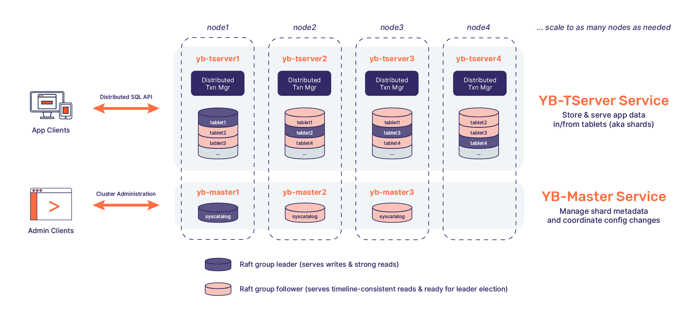
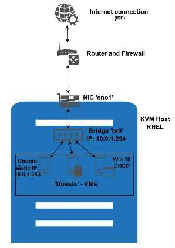
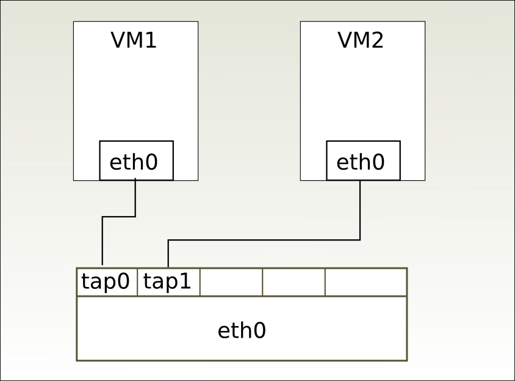
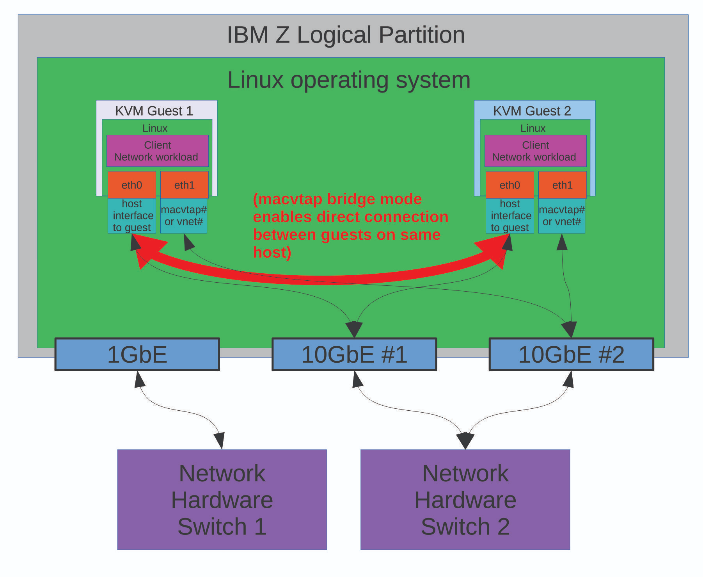
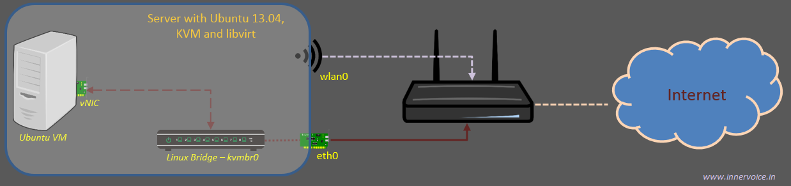
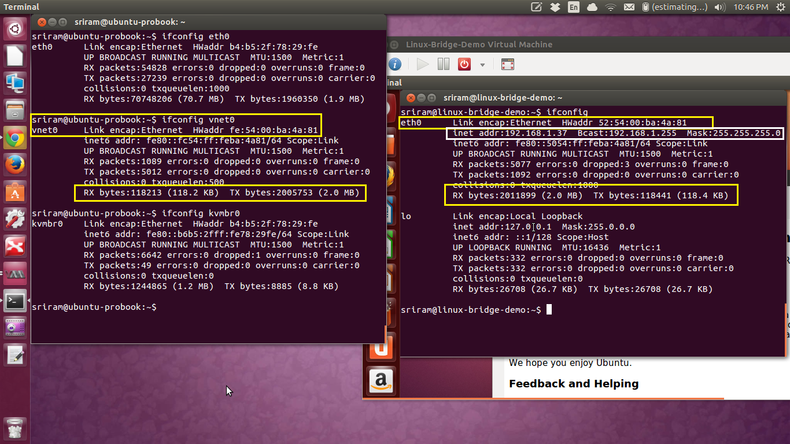

# PlayReact


## Frontend
bundlers like Webpack, Vite, or Parcel.

[traefik](https://blog.sethcorker.com/traefik-routing-for-web-apps/)


for production, only the localhost of the reverse proxy or the ip address of the reverse proxy should be allowed access to the backend application

>>>so someone hosted a backend app behind a reverse proxy in a vm (in linux) and on the main computer, was able to access the application using the ip of the vm and port 80(nginx) and port 9000 where the backend on the vm listens on

`nginx.conf` 
```conf
server {
    listen 80;
    location / {
        proxy_pass http://localhost:9000;
    }
}
```

Leaving port 9000 open is not ideal, especially in production:
- Security: Bypasses NGINX, which may handle authentication, rate limiting, HTTPS, etc.

- Exposed surface: Attackers could find and exploit the backend directly.

##  How to Secure It
- Opttion 1 : Restrict Backend to Localhost

```js
// from 
# Node.js example
app.listen(9000, '0.0.0.0');

//to 
# Good: only accessible from inside the VM
app.listen(9000, '127.0.0.1');
```

Now only NGINX can reach it. The host can’t hit `http://vm-ip:9000` anymore.

- Option 2: Use a Firewall
   1. Using UFW (simpler):
`sudo ufw deny in on eth0 to any port 9000`
   2. using iptables
`sudo iptables -A INPUT -p tcp --dport 9000 -s 0.0.0.0/0 -j DROP`

This keeps the port open locally (for NGINX) but blocks external traffic.


[reverse proxy keycloak](https://www.keycloak.org/server/reverseproxy)

DNS is a distributed protocol via delegations

The `.net` zone delegates everything in `.iana-servers.net` and below to 


`-Dapplication.home=/opt/username/appname`

1. `sbt clean stage`
This generates a directory under `target/universal/stage` containing:

- A runnable script (`bin/your-app-name`)

- Config files

- All dependencies in lib/

Pros:
- Lightweight and fast

- Simple to deploy with shell scripts or systemd

- Easy to automate

2. Create a .tar.gz Package with sbt dist

`sbt clean dist`
Generates a `.zip` or `.tgz` in `target/universal/`
eg `target/universal/myapp-1.0.0.tgz`

You can extract this and run the app using `bin/myapp`

Pros:
- Portable, production-ready bundle

- Includes start scripts

- Standard across many CI/CD setups

by default, `sbt dist` produces a `.zip` file
To generate `.tgz (.tar.gz)` add the following to `build.sbt`


```sh
	sbt 'clean; Universal/packageZipTarball; Universal/packageBin; set Universal/packageName := "apalache"; Universal/packageZipTarball; Universal/packageBin'
```    


When you run`sbt test`,sbt does the following:

1. Looks for a test framework (like ScalaTest, MUnit, etc.)

2. Uses a "runner" provided by that framework to:

  - Discover test classes

  - Run tests

  - Report results (success/failure/etc.)


  `addCommandAlias("dist", "universal:packageXzTarball")`


  

`routesGenerator := InjectedRoutesGenerator`
 `routesGenerator` is the variable,     `playRoutesGenerator` is the task key

 the default is `play.routes.compiler.InjectedRoutesGenerator`

`generateReverseRouter` defaults to true

`generateJsReverseRouter` also defaults to true

 ### Path/Query binding

If you want to use a refined type as a query/path parameter in your `routes` file,
you have a bit more work to do.

First you need to adapt your `build.sbt` file and extend the `routesImport`:

```sbt
routesGenerator := InjectedRoutesGenerator

routesImport ++= Seq(
  "be.venneborg.refined.play.RefinedPathBinders._",
  "be.venneborg.refined.play.RefinedQueryBinders._",
  "eu.timepit.refined.types.numeric.PosInt" //This depends on the refined types you want to use
)
```

And now you can simple use the `PosInt` refined type either as a path or query param in your `routes` file:

```
GET /foobars/:bar     controllers.MyController.foobar(bar: PosInt)
```


Set strong CSP headers (done on the server/CDN side)

```sbt  
.dependsOn(portal % "test->test;compile->compile", admin, guides, api, solr)
  .aggregate(backend, core, admin, portal, guides, api, solr, xquery, xslt)
```
it tells sbt that one project depends on the code from another.

`portal % "test->test;compile->compile"` means:
  1. Compile-time code in portal is available to the current project.

  2. Test code in portal is also available to the current project's tests.

- admin, guides, api, solr are other subprojects this project depends on (for compile->compile by default).

### What is the HTTP Host header?
The HTTP Host header is a mandatory request header as of HTTP/1.1. `It specifies the domain name that the client wants to access`. For example, when a user visits `https://portswigger.net/web-security`, their browser will compose a request containing a Host header as follows:

```http
GET /web-security HTTP/1.1
Host: portswigger.net
```


When you assign an IP to the bridge device (e.g., br0), that IP is used by the host system to communicate with devices on that bridged network.


Assigning an IP address to a bridge device (like br0) allows the host system to participate in the bridged network and communicate with devices connected to that bridge. The host's IP address on the bridge is how it can send and receive packets within that bridged network, similar to how an interface like eth0 would on a regular network. 

When you assign an IP address to a bridge, you're essentially giving the host system an IP address that can be used to communicate on the bridged network. 

the IP assigned to the bridge device belongs to the host
Even though you assign it to the bridge (e.g., ip addr add 192.168.100.1 dev br0), it's the host's network stack that owns and responds to that IP address.


The host machine uses the bridge interface (e.g., br0) to assign itself a Layer 3 IP

- The host can send/receive IP packets via br0.

- Devices connected to the bridge see the host as being present on the same subnet.

- If those devices set their default gateway to 192.168.100.1, they are sending IP packets to the host — not the bridge itself, but the host via the bridge.


## What happens when a device sends a packet to the gateway:
Let’s say a container sends a packet to 8.8.8.8, with 192.168.100.1 as its gateway:

- The container sends an Ethernet frame to the MAC address of 192.168.100.1.

- The bridge (br0) sees that the frame is for the host and delivers it.

- The host’s IP stack receives the packet via br0.

- The host then routes the packet (possibly NATs it) and sends it out via another interface (e.g., eth0).

- Replies come back through eth0, are routed back to br0, and the bridge forwards the reply frame to the container.


`ip addr add 192.168.100.1/24 dev br0`
This causes the host to associate a MAC address with br0 (e.g., 02:42:c0:a8:64:01).

- A connected device sends an IP packet to the gateway IP (192.168.100.1):

- First, it uses ARP to resolve 192.168.100.1 to a MAC address.

- The bridge forwards the ARP request to all ports (including the host via br0).

- The host replies to the ARP request with br0's MAC address.

- The sender sends a frame with destination MAC = host's MAC:

- That Ethernet frame arrives at the bridge.

- The bridge checks its internal MAC address table (learned dynamically).

- It sees that the destination MAC matches the host-side MAC on br0.

- It sends the frame up the stack to the host.

If you assign 192.168.1.100 to br0, the host can use this address to communicate with VMs or other devices on the same subnet (e.g., 192.168.1.x). 

The Linux "br0" interface represents two objects at once:

- the actual layer-2 bridge, which connects all of its assigned "ports" without any IP processing;
- and a bridge port that allows the host OS to be a member of the same bridge.

For example, when you configure a bridge br0 with two ports eth0 and eth1, in reality it has three: the third one is br0 itself. (You could imagine that the actual "bridge" exists somewhere behind br0.)





```sh
ip link add name br0 type bridge
ip link set eno1 master br0
ip link set br0 up
ip link set eno1 up

```

- `eno1` becomes just a Layer 2 port of the bridge — like a cable plugged into a switch.

- The host now talks to the network only through the bridge (br0).

- So unless you assign an IP address to br0, the host will not be reachable on that network.

I was aware of the fact that bridging them together made them the same LAN, but I hadn't considered how the router doesn't have just one IP. It was one IP per LAN, which without a bridge would be per port. So the bridge IP is the router's IP for that LAN.
the VMs do not need an IP address on the bridge "to communicate with the bridge" as such.

But if you want the host and the VMs to be able to communicate with each other in the same IP network segment, assigning an IP address to the bridge device is the way to do it.


- Multiple IP Addresses on the Same Interface (IP Aliasing)

Virtual Interfaces (VLANs)
A single physical network interface can be divided into multiple virtual interfaces using VLANs (Virtual LANs). Each VLAN represents a separate network, but all of them are connected to the same physical interface. This is especially useful in environments where network traffic needs to be segmented logically without requiring additional physical interfaces.

Example:

A physical interface eth0 can have multiple virtual sub-interfaces like eth0.10, eth0.20, etc.

eth0.10 could be assigned to network 192.168.1.0/24 (Network 1), and eth0.20 could be assigned to network 10.0.0.0/24 (Network 2).

Each of these virtual interfaces can be configured to handle traffic for different VLANs, which are treated as separate networks.

```sh
ip link add link eth0 name eth0.10 type vlan id 10
ip addr add 192.168.1.10/24 dev eth0.10
```


```sh
Client (DNS Resolver)                     Server (DNS Server)
      |                                             |
      |----- UDP DNS Query (Port 53) -------------->|
      |                                             |
      |<--- UDP DNS Response (Port 53) -------------|
      |                                             |
```


[](https://www.net.in.tum.de/fileadmin/TUM/NET/NET-2024-04-1/NET-2024-04-1_16.pdf)
sokcet-> tcp/udp->ipv4->ethernet->network card


a socket either passes a packet
to the user space application or receives a packet from
the implementation of the transport layer protocol, i. e.,
TCP or UDP. The IP layer then routes the packets to
the network layer. Below this layer, Linux allows filtering traffic via firewall rules. The network interface card (NIC)
forwards the packets that it receives from the receive (RX)
buffer to the kernel and transmits packets read from the
transmit (TX) buffer.

[how-does-an-application-receive-a-network-packet](https://cloudchirp.medium.com/how-does-an-application-receive-a-network-packet-27451965efb)

[From VLAN to IPVLAN: Virtual Network Device and Its Application in Cloud-Native](https://www.alibabacloud.com/blog/599797#:~:text=Just%20like%20a%20normal%20data%20packet%2C%20it,pfmemalloc%2C%20struct%20packet_type%20**ppt_prev)%20%7B%20rx_handler_func_t%20*rx_handler;)



macvtap


“Macvtap is a new device driver meant to simplify virtualized bridged networking. It replaces the combination of the tun/tap and bridge drivers with a single module based on the macvlan device driver. A macvtap endpoint is a character device that largely follows the tun/tap ioctl interface and can be used directly by kvm/qemu and other hypervisors that support the tun/tap interface. The endpoint extends an existing network interface, the lower device, and has its own mac address on the same ethernet segment. Typically, this is used to make both the guest and the host show up directly on the switch to which the host is connected


A key difference between using a bridge is that MacVTap connects directly to the network interface in the KVM host. This direct connection effectively shortens the codepath, by bypassing much of the code and components in the KVM host associated with connecting to and using a software bridge. This shorter codepath usually improves throughput and reduces latencies to external systems.


A Tap interface is a software-only interface. Instead of passing frames to and from a physical Ethernet card, the frames are read and written by a user space program. The kernel makes the Tap interface available via the /dev/tapN device file, where N is the index of the network interface.

`the user space program is the hypervisor, typically QEMU/KVM`
A Macvtap interface combines the properties of  these two; it is an virtual interface with a tap-like software interface. A Macvtap interface can be created using the ip command:

`sudo ip link add link eth0 name macvtap0 type macvtap`

[choices-using-macvtap-driver](https://www.ibm.com/docs/en/linux-on-systems?topic=choices-using-macvtap-driver)


[Linux Bridge and Virtual Networking](https://cloudbuilder.in/blogs/2013/12/02/linux-bridge-virtual-networking/#:~:text=This%20interface%20vnet0%20is%20a,this%20in%20the%20next%20post.&text=Now%20just%20like%20you%20connect,NIC%20has%20external%20network%20connectivity.)



In order to give Internet connectivity to this VM, we will have to associate the virtual NIC of the VM to the physical NIC of the server. This association is facilitated by the Linux bridge

 The newly created VM will get its IP address etc (via DHCP) from the router in the middle.

 TAP Interface (in bridged networking)
A TAP device is a virtual network interface that operates at Layer 2 (Ethernet frames).

Created on the host system (e.g., tap0, vnet0).

Used by the host-side of the VM’s virtual NIC.

Connected to a software bridge (e.g., br0) that also includes the physical NIC (eth0).

The bridge is host-based — created, configured, and active in the host OS — and the hypervisor just plugs the VM's virtual NIC into it via TAP.


`Now just like you connect an Ethernet (RJ-45) cable from a physical NIC to an port (interface) on a physical switch, the VM’s virtual NIC is connected to this virtual tap interface on the Linux bridge`. The below screenshot highlights the relationship between the VM’s virtual NIC and the Linux Bridge tap interface.



- The first thing to notice is the similarities in the MAC address of vnet0 (on the host server) and the eth0 (virtual NIC in the VM).
- The next giveaway is the data transmitted and received on each of the interface. Since there is a direct 1-1 relationship, the TX bytes of the VM NIC matches the RX bytes of _vnet0. _And vice-versa.
- Finally, we can see that the Virtual NIC has been configured with IP address and gateway etc. This configuration is done using the DHCP server on my physical router. This implies that virtual NIC has external network connectivity.

### Traffic from External Network to VM
- A frame arrives at eth0 from the LAN/switch (e.g., from a DHCP server or another host).

- Since eth0 is in promiscuous mode and enslaved to the bridge, it hands the frame to the bridge (br0).

- The bridge inspects the destination MAC address.

- If the MAC matches the VM’s virtual NIC, the bridge forwards it to the TAP device (vnet0).

- The TAP device delivers the frame to the VM.


### VM wants to send a packet to Google DNS (8.8.8.8)
- VM creates an IP packet with:

Destination IP: 8.8.8.8

- VM wraps it in an Ethernet frame, with:

Destination MAC: the default gateway’s MAC (learned via ARP).

- Ethernet frame goes from:

VM → vnet0 → br0

- br0 has learned:

“The gateway's MAC is reachable via eth0.”
- So the bridge forwards the frame to eth0, which transmits it on the physical wire toward the router.


The network data traffic is handled by the physical Ethernet ports on physical machines. Similarly for virtual machines this traffic needs to be handled by the virtual ethernet ports.

. Linux bridge also supports virtual ports. Since virtual ports are actually software entities,  other software entities can use them to send Ethernet frames to the virtual switch for further processing. For Ethernet traffic, these Linux virtual ports are called tap interfaces. Tap interfaces can be added to a Linux bridge just like physical interfaces.


## Tap interfaces - Why do we need them?
Like their physical counterparts, virtual machines network ports can only process Ethernet frames. In non-virtualized environments, the physical NIC interface will receive and process the Ethernet frames. It will strip out the Ethernet related overhead bytes and forward the payload (usually IP packets) further up to the OS. With virtualization however, this will not work since the virtual NICs would expect Ethernet frames. This is where tap interfaces come into picture. Tap interfaces are special software entities which tell the Linux bridge to forward Ethernet frames as it is. In other words, the virtual machines connected to tap interfaces will be able to receive raw Ethernet frames. And due to this virtual machines can continue to emulate physical machines from a networking perspective.

### Is there a virtual RJ45 cable as well?
The short answer is no. But there is a need for connecting a virtual Ethernet port of a VM to the tap interface on a Linux bridge. This connection is achieved programmatically. Applications such as libvirt create a “file descriptor” using the tap interface. When Linux bridge sends Ethernet frames to a tap interface, it actually is sending the bytes to a file descriptor. Emulators like QEMU, read the bytes from this file descriptor and pass it onto the “guest operating system” inside the VM, via the virtual network port on the VM. **Note:**Tap interfaces are listed as part of the ifconfig Linux command.

[Tap Interfaces and Linux Bridge](https://cloudbuilder.in/blogs/2013/12/08/tap-interfaces-linux-bridge/)

When you bind the interface to the bridge - the forwarding from L2 to L3 layers happens on the bridge. So the IP Address (L3) needs to be on the bridge.

[using-mac-table-linux-bridge](https://cloudbuilder.in/blogs/2015/01/26/using-mac-table-linux-bridge-wilt/)

[understanding-virtual-networks-ports-and-vlan](https://cloudbuilder.in/blogs/2012/08/30/understanding-virtual-networks-ports-and-vlan/)

Enslaved to a Bridge:
When an interface is enslaved to a bridge, it means that the bridge takes control of all traffic passing through that interface. 

[vlan](https://mum.mikrotik.com/presentations/ID18/presentation_5972_1540283619.pdf#:~:text=become%20slave%20ports%2C%20this%20means%20that%20all,setting%20!%20ease%20of%20maintenance%20and%20trouble%2Dshooting.)