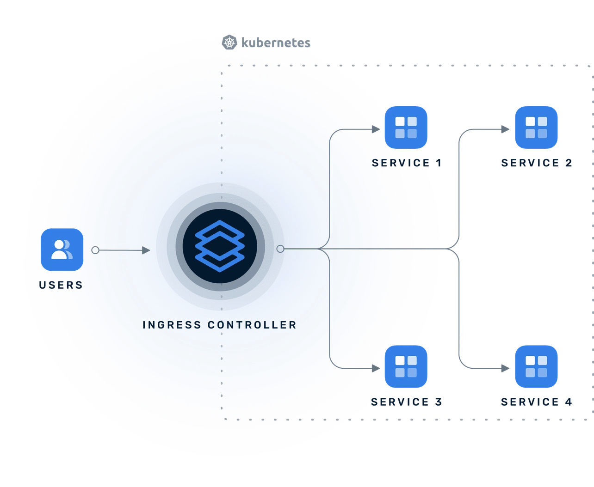

# Systemd
- Systemd is an 'init system'
- It is the most importat process running on your server(pid 1)
- it manages all services that run in the background
- When you start a process on a linux server such as nginx or apache,the request to start that process is sent to the init system(eg systemd) which then starts it up. Stopping,reloading,starting  a process is all done by the init system

## Units
- Units in systemd are resources that it's able to manage 
- These include services,timers,mounts,automounts and more
- Essentially, these are types of Units(eg service)
- `systemd` is the system and service manager that runs as PID 1 and is responsible for initializing the system, managing services, and handling units (like services, sockets, devices, etc.).

- `systemctl` is a user interface to interact with systemd. It sends commands to the systemd daemon (usually via D-Bus).

Systemd unit directories
- /etc/systemd/system //highest priority
- /run/systemd/system
- /lib/systemd/system //lowest priority


## Nginx

- NGINX location directive syntax

```sh
location [modifier] [URI] {
  ...
  ...
}
```

To find a location match for an URI, NGINX first scans the locations that is defined using the prefix strings (without regular expression). Thereafter, the location with regular expressions are checked in order of their declaration in the configuration file. NGINX will run through the following steps to select a location block against a requested URI.

 - **NGINX location matching all requests**
In the following example the prefix location / will match all requests but will be used as a last resort if no matches are found.

```conf
location / {
    ...
}
```

- **NGINX location matching exact URL**
NGINX always tries to match most specific prefix location at first. Therefore, the equal sign in the following location block forces an exact match with the path requested and then stops searching for any more matches.
```conf
location = /images { 
    ...
}
```

The above location block will match with the URL `https://domain.com/images` but the URL `https://domain.com/images/index.html` or `https://domain.com/images/` will not be matched.


### What Is an API Gateway?
An API gateway is a critical component of modern microservices architectures that help to secure, route, and observe tremendous volumes of requests from both people and other applications.

API gateways centralize security and routing, allowing you to better handle cross-cutting concerns such as access control, rate limiting, and analytics. Additionally, API gateways make it easier to enforce security policies, optimize performance across multiple services, and scale your operations.


In order to support modern environments, API gateways must be cloud native, fully declarative, and aligned to GitOps principles. Additionally, API gateways need to be able to manage requests to and from applications in public and private cloud, hybrid cloud, multi-cloud, multi-orchestrator, and on-prem application


tls depends on tcp


## What Is a Kubernetes Ingress Controller?
Kubernetes offers multiple ways to route traffic from the outside world to Kubernetes clusters. The most flexible option is to define an ingress resource that declares HTTP/S endpoints and user-defined routing rules. Each ingress resource is associated with an ingress controller responsible for fulfilling those rules within the Kubernetes cluster.




```sh
Client ──► Ingress Controller (reverse proxy) ──► Service ──► Pod
                  ▲
           Routes based on Ingress rules
```

These are all reverse proxies under the hood:

- NGINX Ingress Controller → uses nginx

- HAProxy Ingress Controller → uses haproxy

- Traefik Ingress Controller → has its own built-in reverse proxy
Kubernetes Ingress Controller is a reverse proxy

`Client ---> [Ingress Controller (reverse proxy)] ---> [Kubernetes Services/Pods]`

 Examples of Ingress Controllers:
- NGINX Ingress Controller (most common)

- HAProxy Ingress

- Traefik


Traefik is an open-source Application Proxy 

What sets Traefik apart, besides its many features, is that it automatically discovers the right configuration for your services. The magic happens when Traefik inspects your infrastructure, where it finds relevant information and discovers which service serves which request.


Traefik’s main concepts help you understand how requests flow to your services:

- **Entrypoints** are the network entry points into Traefik. They define the port that will receive the packets and whether to listen for TCP or UDP.
- **Routers** are in charge of connecting incoming requests to the services that can handle them. In the process, routers may use pieces of middleware to update the request or act before forwarding the request to the service.
- **Services** are responsible for configuring how to reach the actual services that will eventually handle the incoming requests.
- **Providers** are infrastructure components, whether orchestrators, container engines, cloud providers, or key-value stores. The idea is that Traefik queries the provider APIs in order to find relevant information about routing, and when Traefik detects a change, it dynamically updates the routes.
These concepts work together to manage your traffic from the moment a request arrives until it reaches your application.